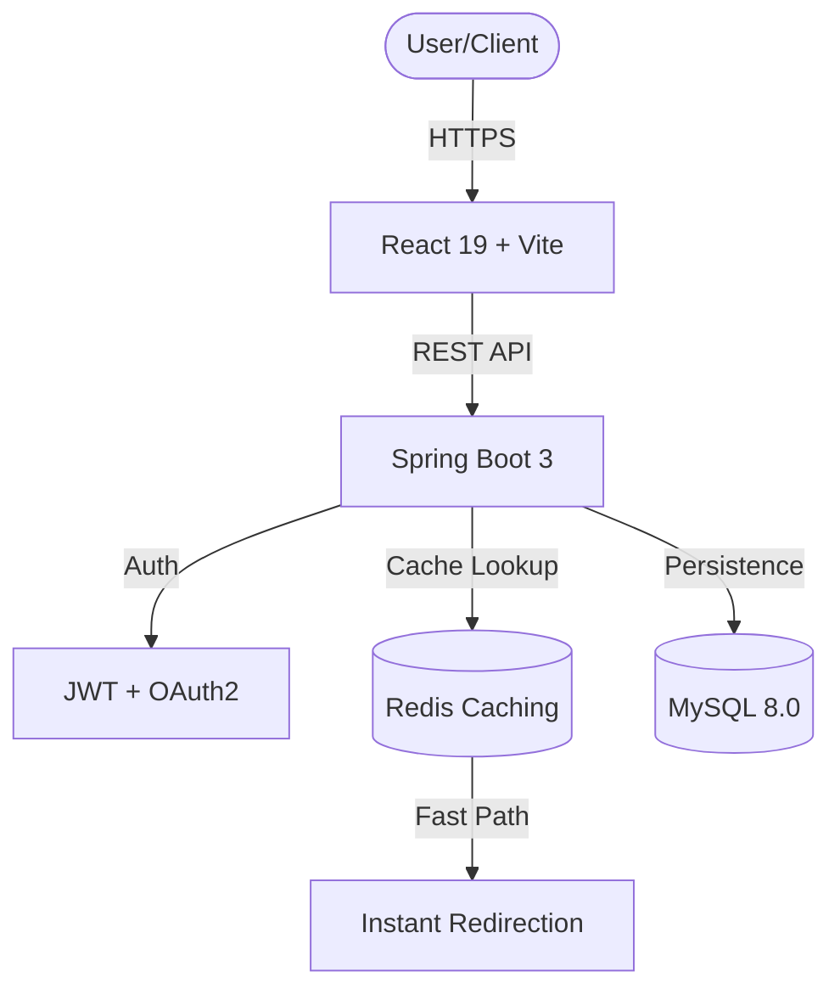

# 🔗 LinkMagic - Enterprise-Grade URL Shortener

[](https://github.com/Arbaz4Sayyad/linkmagic-url-shortener)
[](https://github.com/Arbaz4Sayyad/linkmagic-url-shortener)
[](https://opensource.org/licenses/MIT)
[](https://spring.io/projects/spring-boot)

LinkMagic is a **production-ready, full-stack URL shortening platform** engineered for high-growth teams. Built with a high-performance **Spring Boot 3** backend and a premium **React 19** frontend, it delivers an industry-leading SaaS experience inspired by **Stripe, Vercel, and Linear**.

---

## 🏗️ System Architecture

LinkMagic leverages a multi-tier architecture designed for ultra-low latency redirection and high availability.



---

## 🚀 Key Capabilities

- ⚡ **Ultra-Fast Redirection**: Sub-millisecond resolution via Redis-backed cache.
- 🧠 **AI-Powered Insights**: Smart, human-readable performance summaries (e.g., *"Engagement increased by 30% this week"*).
- 📊 **Precision Analytics**: Real-time tracking for clicks, IP geolocation (Country/City), browser, OS, and referral sources.
- 🔐 **Hardened Security**: JWT-based session management with Google/GitHub SSO.
- 🔗 **Bulk Shortening**: Enterprise-grade CSV ingestion for massive link deployments.
- 📱 **Adaptive "Midnight" UI**: A premium, glassmorphism-driven design system inspired by Vercel/Linear.
- 🔑 **Developer-First**: Full API key lifecycle management for headless integrations.

---

## 🛠️ Tech Stack

### Backend Engine
- **Framework**: Spring Boot 3.2.5 (Java 17)
- **Database**: MySQL 8.0 (Relational) + Redis (Edge Caching)
- **Security**: Spring Security + JWT + OAuth2 (SSO)
- **Analytics**: `yauaa` (User-Agent Parsing) + `ip-api` (Geolocation)
- **Migration**: Flyway-managed schema evolution

### Frontend Experience
- **Framework**: React 19 + Vite (Modern ESM)
- **Styling**: Tailwind CSS + Framer Motion (Fluid Animations)
- **Visualization**: Recharts (Dynamic Analytics Dashboards)
- **Icons**: Lucide-React + Modern Lucide SVG system

---

## 📖 API Documentation

### Shorten a URL
`POST /api/v1/shorten`

```bash
curl -X POST http://localhost:8080/api/v1/shorten \
  -H "Header: Authorization: Bearer <TOKEN>" \
  -d '{"originalUrl": "https://google.com"}'
```

### Get Smart Analytics
`GET /api/v1/analytics/{shortCode}`

**Response:**
```json
{
  "totalClicks": 1240,
  "peakHour": "14:00",
  "topCountry": "United States",
  "deviceDistribution": [{"name": "Desktop", "value": 850}, ...],
  "trendData": [{"date": "2024-04-02", "clicks": 120}, ...]
}
```

### Get AI Insights
`GET /api/v1/analytics/{shortCode}/insights`

**Response:**
```json
{
  "insights": [
    "Your link performs best at 2 PM local time. ⏰",
    "Users are primarily visiting via desktop devices. 📱",
    "Engagement increased by 15.4% this week! 🚀"
  ]
}
```

---

## ⚙️ Development Setup

### Infrastructure (Docker)
Ensure Docker is running and execute:
```bash
docker-compose up -d --build
```

### Manual Service Start
| Service | Directory | Command |
| :--- | :--- | :--- |
| **Backend** | `./backend` | `mvn spring-boot:run` |
| **Frontend** | `./frontend` | `npm run dev` |

---

## 🧪 Testing Strategy
We maintain a high quality bar through comprehensive test coverage:
* **Backend**: Junit 5 + Mockito (Service layer), Testcontainers (Integration).
* **Frontend**: Vitest + React Testing Library (Component & Logic).

---

## 🛡️ Security Implementation
- **Rate Limiting**: Redis-based throttling to prevent brute-force attacks.
- **Input Sanitization**: Extreme validation on original URLs to prevent XSS/SSRF.
- **Stateless Auth**: JWT signatures with secure session handling.

---

## 🤝 Contributing
Engineered for extensibility. See [CONTRIBUTING.md](CONTRIBUTING.md) for architectural guidelines and PR standards.

---

## 📜 License
Distributed under the **MIT License**. Created by [Arbaz Sayyad](https://github.com/Arbaz4Sayyad).
