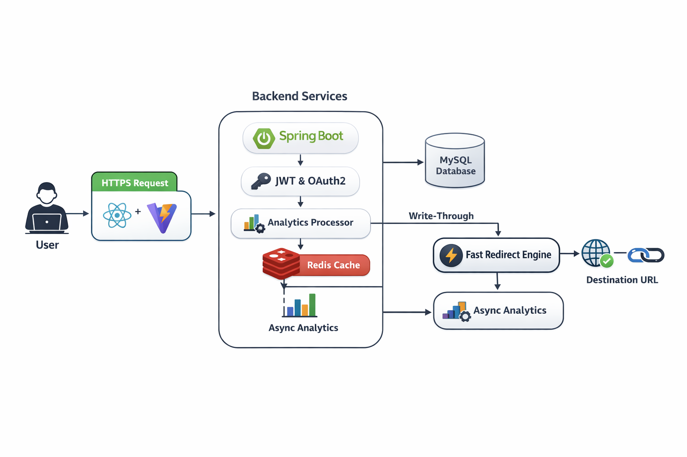

# 🔗 LinkMagic — Scalable URL Shortener System

[](https://github.com/Arbaz4Sayyad/linkmagic-url-shortener)
[](https://opensource.org/licenses/MIT)
[](https://spring.io/projects/spring-boot)

---

## 🚀 Overview

**LinkMagic** is a **high-performance, distributed URL shortening system** designed for **low latency, high throughput, and scalability**.

Inspired by systems like **Bitly**, it is engineered to handle **read-heavy traffic**, deliver **sub-10ms redirects**, and scale horizontally under load.

---

## 🎬 Product Demo

<div align="center">
  <video src="https://raw.githubusercontent.com/Arbaz4Sayyad/linkmagic-url-shortener/main/screenshots/URL-Shortener-Demo-Vid.mp4" width="100%" controls muted loop></video>
</div>

---

## 🏗️ High-Level Architecture

<p align="center">
  
</p>

---
### 🧠 Architecture Overview

- Client requests are routed through API layer
- Redis serves as a fast cache for redirection
- MySQL ensures persistent storage
- Async analytics handled separately to avoid latency impact

---

## 🔄 Request Flow

### 🔹 URL Shortening (Write Path)

1. User submits long URL
2. Backend generates unique short code (Base62)
3. Mapping stored in MySQL
4. Entry written to Redis (write-through cache)
5. Short URL returned

### 🔹 Redirection (Read Path)

1. User hits short URL
2. Redis lookup (O(1))
3. Cache hit → instant redirect
4. Cache miss → DB lookup → cache update

---

## ⚡ Key Features

* ⚡ **Sub-10ms redirection latency** using Redis caching
* 🔑 **Base62 encoding** for compact URL generation
* 📊 **Asynchronous analytics pipeline**
* 🔁 **Idempotent APIs for safe retries**
* 🧱 **Stateless services for horizontal scaling**
* 🔐 **Secure authentication (JWT + OAuth2)**

---

## 🧠 System Design Decisions

### 1. Read-Heavy Optimization

* URL systems are **read-dominant (~90%)**
* Redis used as primary read layer

👉 Result: **Low latency + reduced DB load**

---

### 2. Write-Through Caching Strategy

* Cache updated during writes
* Ensures consistency between DB & cache

👉 Trade-off:

* Slightly slower writes
* Much faster reads

---

### 3. Service Decomposition

* Redirect service separated from analytics

👉 Why:

* Prevent latency increase
* Improve fault isolation

---

### 4. Async Analytics Processing

* Analytics handled via background processing

👉 Benefits:

* Non-blocking API
* Better scalability

---

### 5. ID Generation (Base62)

* Efficient and compact encoding
* Avoids collisions with proper handling

👉 Future:

* Distributed ID generation (Snowflake)

---

### 6. Database Optimization

* Indexed `shortCode` column
* Optimized queries for concurrency

---

## 📈 Scalability Strategy

* Stateless services → horizontal scaling
* Load balancer for traffic distribution
* Redis caching for hot data
* Async processing for heavy workloads

---

## ⚠️ Trade-offs

* Eventual consistency in analytics
* Cache invalidation complexity
* Increased system complexity

---

## 🛠️ Tech Stack

### Backend

* Java 17, Spring Boot 3
* MySQL 8.0
* Redis

### Frontend

* React 19, Vite
* Tailwind CSS, Framer Motion

### Infrastructure

* Docker
* AWS (EC2, RDS, S3)

---

## 📊 API Documentation

### 🔹 Create Short URL

```
POST /api/v1/shorten
```

```bash
curl -X POST http://localhost:8080/api/v1/shorten \
  -H "Authorization: Bearer <TOKEN>" \
  -d '{"originalUrl": "https://google.com"}'
```

---

### 🔹 Redirect

```
GET /{shortCode}
```

---

### 🔹 Get Analytics

```
GET /api/v1/analytics/{shortCode}
```

**Response:**

```json
{
  "totalClicks": 1240,
  "peakHour": "14:00",
  "topCountry": "United States"
}
```

---

### 🔹 Get AI Insights

```
GET /api/v1/analytics/{shortCode}/insights
```

**Response:**

```json
{
  "insights": [
    "Your link performs best at 2 PM local time",
    "Users are primarily visiting via desktop devices",
    "Engagement increased this week"
  ]
}
```

---

## 🛡️ Reliability & Fault Handling

* Retry mechanisms for transient failures
* TTL-based cache eviction
* Idempotent API design
* Input validation (XSS/SSRF protection)

---

## 🧪 Testing Strategy

* Unit Testing: JUnit, Mockito
* Integration Testing: Testcontainers
* Frontend Testing: Vitest

---

## ⚙️ Development Setup

### Docker

```bash
docker-compose up -d --build
```

### Manual Run

| Service  | Command               |
| -------- | --------------------- |
| Backend  | `mvn spring-boot:run` |
| Frontend | `npm run dev`         |

---

## 🚀 Future Improvements

* Rate limiting (Redis-based)
* Kafka for async event streaming
* CDN for global redirection
* Multi-region deployment

---

## 🤝 Contributing

Contributions are welcome!
Follow standard Git workflow and open a PR.

---

## 📜 License

Distributed under the **MIT License**.

---

## 👨‍💻 Author

**Arbaz Sayyad**
Backend Engineer | Java | Spring Boot | Distributed Systems

* 📧 [arbaz4sayyad@gmail.com](mailto:arbaz4sayyad@gmail.com)
* 🔗 https://www.linkedin.com/in/arbaz-sayyad/
